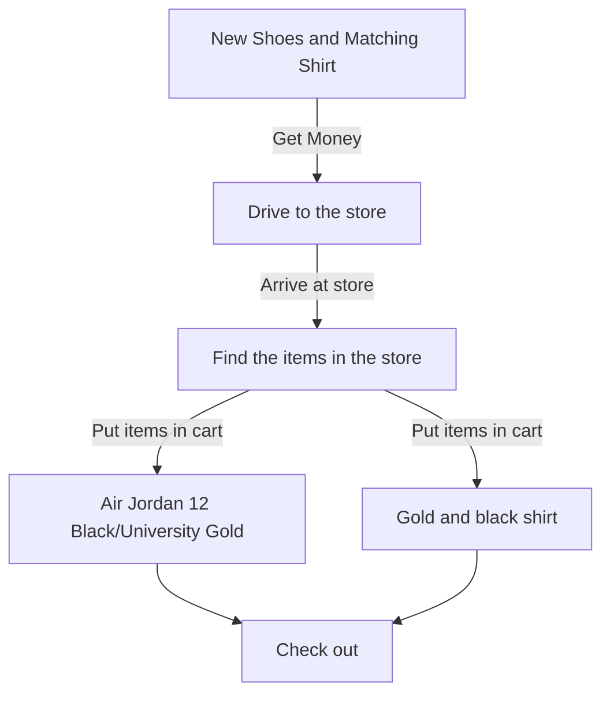

New shoes and matching shirt enitiy requries you to have the money and the place to buy said items. If you have those items then you must drive to the store and then actually arrive at the place before you can go shopping. Once that has been done you can go begin shopping for the items you wish to buy (Air Jordan 12/Balck university gold and Gold and black shirt) Then head to the check out and buy the items. 
